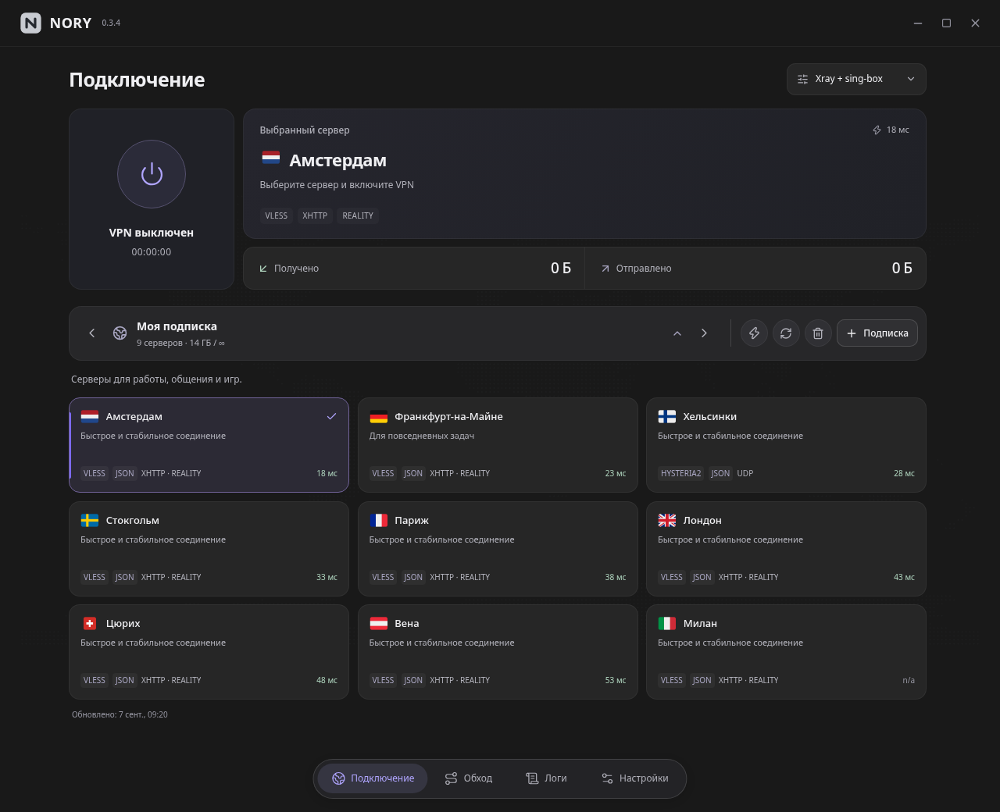

# NORY

VPN-клиент для Linux и Windows 11. Два ядра, один интерфейс.

[Скачать](https://github.com/wasteprince/nory/releases/latest) · [Что нового](https://github.com/wasteprince/nory/releases) · [Telegram](https://t.me/linuxset)

*Актуальный интерфейс с демонстрационными серверами.*

## Возможности

- TUN через **Xray + sing-box** или **Mihomo**.
- Несколько подписок, HWID и описания серверов.
- Конфигурации Xray JSON и Mihomo JSON, преобразование поддерживаемых протоколов и балансировщиков.
- Обход VPN для приложений и процессов, переключатель GeoData RU.
- Пинг всех серверов, статистика трафика, трей и логи.
- Подписанные обновления из GitHub.

## Установка

| Система | Пакет 0.3.7 | Как установить |
| --- | --- | --- |
| Arch Linux x86_64 | [pkg.tar.zst](https://github.com/wasteprince/nory/releases/download/v0.3.7/nory-0.3.7-1-x86_64.pkg.tar.zst) | `sudo pacman -U ./nory-0.3.7-1-x86_64.pkg.tar.zst` |
| Ubuntu 24.04+ / Debian 13+ amd64 | [deb](https://github.com/wasteprince/nory/releases/download/v0.3.7/nory_0.3.7_amd64.deb) | `sudo apt install ./nory_0.3.7_amd64.deb` |
| Windows 11 x64 | [Установщик](https://github.com/wasteprince/nory/releases/download/v0.3.7/NORY-0.3.7-windows-x64-setup.exe) | Запустить скачанный `.exe` |

Ядра входят в комплект. Перед ручным обновлением закройте NORY через трей — подписки и настройки сохранятся.

Linux требует systemd и WebKitGTK 4.1; пакетный менеджер установит зависимости.
Debian 12, Ubuntu 22.04, Windows 10 и ARM64 этой сборкой не поддерживаются.
На Windows может появиться SmartScreen; при отсутствии WebView2 установщику нужен интернет.
[Подробнее о Windows, правах и ограничениях](https://github.com/wasteprince/nory/blob/main/WINDOWS.md).

## Обратная связь

[Сообщить об ошибке](https://github.com/wasteprince/nory/issues) — укажите систему, версию и выбранное ядро. Не публикуйте ссылки подписок, пароли и HWID.

**TG канал разработчика:** [@linuxset](https://t.me/linuxset)

## Исходники

[Сборка и структура проекта](desktop/README.md). В репозитории — код клиента, ресурсы и файлы упаковки. Готовые установщики находятся в [Releases](https://github.com/wasteprince/nory/releases).

[Изменения в 0.3.7](https://github.com/wasteprince/nory/releases/tag/v0.3.7) включены в пакеты для всех трёх систем.

---

Rust · Tauri · Vue · TypeScript · Tailwind CSS

Ядра: [Xray](https://github.com/XTLS/Xray-core), [sing-box](https://github.com/SagerNet/sing-box), [Mihomo](https://github.com/MetaCubeX/mihomo).
