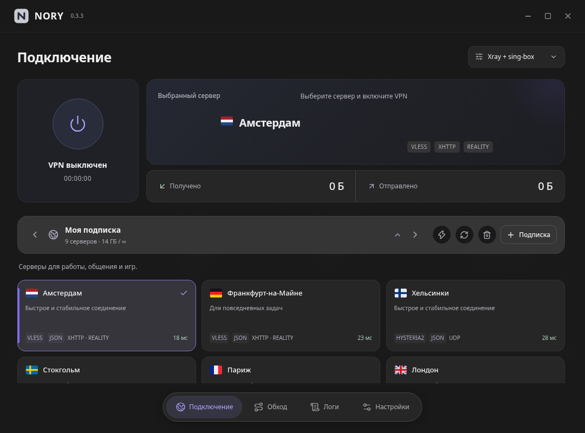

# NORY

**Два ядра. Один нативный VPN-клиент.**

Минималистичный интерфейс · Linux · Windows 11 Preview · Xray + sing-box · Mihomo

[Скачать](https://github.com/wasteprince/nory/releases/latest) · [Сообщить об ошибке](https://github.com/wasteprince/nory/issues) · [TG канал разработчика](https://t.me/linuxset)

## Windows 11 — предварительная сборка 0.2.29

[Скачать Windows-установщик](https://github.com/wasteprince/nory/releases/tag/v0.2.29) · [Особенности и ограничения](WINDOWS.md)

Нативный Rust-клиент, два TUN-режима, системная служба, встроенные ядра,
Wintun и библиотеки интерфейса. **251 флаг встроен в `.exe` только для Windows**;
в Linux остаются системные флаги и глобус. Поддерживается только Windows 11 x64.

Проверены сборка, установка, запуск интерфейсных компонентов и связь со службой
в Wine. Реальный TUN/WFP и обход приложений на Windows 11 ещё требуют проверки.
Это Preview, а стабильный Linux-релиз остаётся **0.2.28**.

## Linux: новое в 0.2.28

Исправлена ошибка подключения Mihomo для серверов с запятыми в названиях,
например `[№1, HYSTERIA] 🇸🇪 Швеция`. Имена серверов и балансировщиков сохраняются,
а правила маршрутизации используют безопасные внутренние имена.
Исправление применяется и к уже сохранённым подпискам — повторный импорт не нужен.
При импорте отдельного Mihomo JSON имя прокси больше не подменяется его описанием.

## Просто подключиться

NORY — нативное приложение на Rust и GTK4 / libadwaita, без браузера и WebView.
Добавьте подписку, выберите сервер и включите VPN.

- **Два TUN-режима:** Xray с sing-box или Mihomo. Ядра входят в Linux-пакеты; переключение останавливает предыдущий VPN-бэкенд.
- **Подписки:** несколько независимых подписок, HWID, описания серверов и обновление списка.
- **Конфигурации:** импорт Xray JSON и Mihomo JSON, преобразование поддерживаемых протоколов и балансировщиков между ядрами. Если есть конфигурации для обоих ядер, используются родные варианты. Возможности ядер различаются — не каждый параметр можно перенести без потерь.
- **Обход VPN:** выбор приложений и процессов, поиск по списку; встроенный обход России по GeoSite category-ru и GeoIP ru, выключенный по умолчанию.
- **Повседневные инструменты:** массовый ICMP-пинг, статистика трафика, трей, настройки и подробные логи.
- **Обновления из GitHub Releases:** подпись Ed25519, проверка размера и SHA-256 перед установкой.

## Установка

Скачайте пакет своей системы на [странице последнего релиза](https://github.com/wasteprince/nory/releases/latest).
Запускайте NORY из меню приложений, не от root; системные действия выполняются через отдельный helper.

| Система | Файл | Установка из папки с пакетом |
| --- | --- | --- |
| Arch Linux, x86_64 | `nory-…-x86_64.pkg.tar.zst` | `sudo pacman -U ./nory-0.2.28-1-x86_64.pkg.tar.zst` |
| Debian-подобные, amd64 | `nory_…_amd64.deb` | `sudo apt install ./nory_0.2.28_amd64.deb` |

Для Linux нужны systemd, GTK4 и libadwaita. Пакет `.deb` не означает совместимость со всеми старыми выпусками Debian/Ubuntu: доступные версии системных библиотек должны соответствовать сборке. Windows-установщик доступен отдельно в [Preview 0.2.29](https://github.com/wasteprince/nory/releases/tag/v0.2.29); macOS-сборки нет.

## Переход на GitHub

**0.2.25 — переходный релиз.** Установленные версии со старым источником обновлений получат его через прежний сервер. После установки NORY проверяет новые версии и скачивает пакеты только с GitHub.

Каналы Arch и Debian остаются раздельными. Старый сервер сохраняется для перехода существующих клиентов, но новых релизов после 0.2.25 там не будет. Архив старых версий на GitHub не переносится.

## Обратная связь

В [issue](https://github.com/wasteprince/nory/issues) укажите версию NORY, дистрибутив, выбранное ядро и шаги воспроизведения. Прикладывайте только обезличенные логи: удалите ссылки подписок, UUID, пароли и HWID.

**TG канал разработчика:** [t.me/linuxset](https://t.me/linuxset)

Ядра: [Xray](https://github.com/XTLS/Xray-core), [sing-box](https://github.com/SagerNet/sing-box), [Mihomo](https://github.com/MetaCubeX/mihomo). У компонентов собственные лицензии; они включены в установочные пакеты.
