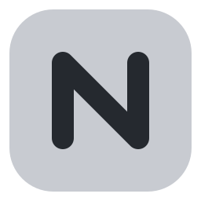
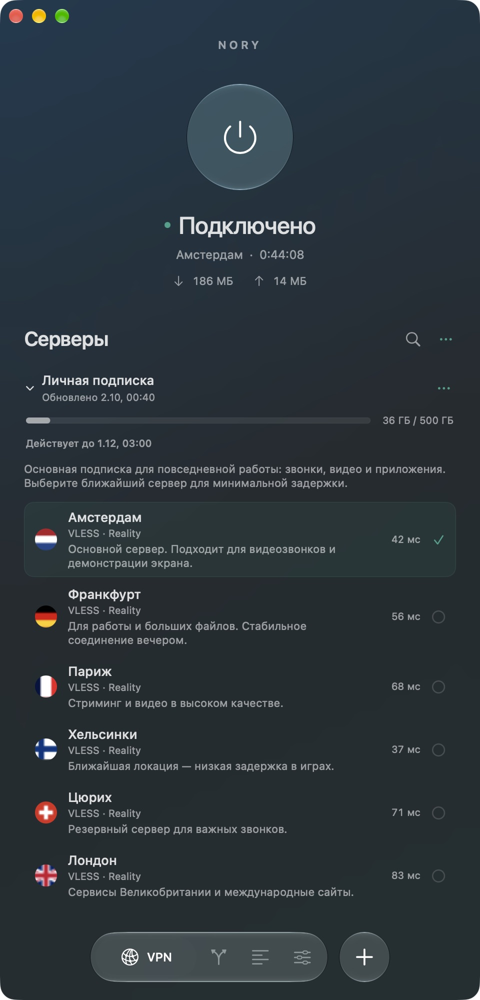

# NORY

Нативный VPN-клиент для macOS, Windows и Linux.

**[Скачать](#скачать)** · [Установка](INSTALL.md) · [Изменения](CHANGELOG.md) · [Сообщить об ошибке](https://github.com/wasteprince/nory/issues)

 

macOS · Liquid Glass · демонстрационные данные

## Скачать

**[NORY 0.4.9](https://github.com/wasteprince/nory/releases/tag/v0.4.9)** · Windows 11 и macOS

| Система | Совместимость | Установщик |
| :--- | :--- | :--- |
| **macOS** | macOS 26+ · Apple Silicon, включая MacBook Neo | [Скачать PKG](https://github.com/wasteprince/nory/releases/download/v0.4.9/NORY-0.4.9-macos-arm64.pkg) |
| **macOS Intel** | macOS 26+ · x86_64 | [Скачать PKG](https://github.com/wasteprince/nory/releases/download/v0.4.9/NORY-0.4.9-macos-x86_64.pkg) |
| **Windows 11** | Windows 11 · x64 | [Скачать EXE](https://github.com/wasteprince/nory/releases/download/v0.4.9/NORY-0.4.9-windows-x64-setup.exe) |

> **В 0.4.9:** обход сайтов на всех платформах; исправления выбора приложений, маршрутизации и очистки TUN на Windows.

Другие форматы и контрольные суммы

- macOS: [DMG](https://github.com/wasteprince/nory/releases/download/v0.4.9/NORY-0.4.9-macos-arm64.dmg) · [ZIP](https://github.com/wasteprince/nory/releases/download/v0.4.9/NORY-0.4.9-macos-arm64.zip).
- macOS Intel: [DMG](https://github.com/wasteprince/nory/releases/download/v0.4.9/NORY-0.4.9-macos-x86_64.dmg) · [ZIP](https://github.com/wasteprince/nory/releases/download/v0.4.9/NORY-0.4.9-macos-x86_64.zip).
- Windows 11: [ZIP](https://github.com/wasteprince/nory/releases/download/v0.4.9/NORY-0.4.9-windows-x64.zip) для ручного развёртывания. Служба TUN устанавливается через EXE.
- [Контрольные суммы SHA-256](https://github.com/wasteprince/nory/releases/download/v0.4.9/SHA256SUMS.txt).

При переходе с 0.3.x нужна [ручная установка](INSTALL.md#windows). Требования к системе и особенности подписи пакетов — в [инструкции](INSTALL.md).

## Возможности

- **Подписки:** несколько источников, описания серверов, лимиты трафика и срок действия.
- **Серверы:** список или карточки, поиск, проверка задержки и круглые флаги.
- **Маршрутизация:** routing, DNS и outbounds из JSON сервера; обход VPN для приложений, сайтов и поддоменов.
- **Интерфейс:** тёмное оформление, системные кнопки окна, плавающая навигация и журнал подключений.

Xray + sing-box TUN. Нативные интерфейсы: SwiftUI на macOS, WinUI 3 на Windows, GTK4 / libadwaita на Linux (бета-версия). Android и iOS пока не выпущены.

---

[Релизы](https://github.com/wasteprince/nory/releases) · [Установка](INSTALL.md) · [История изменений](CHANGELOG.md) · [Обратная связь](https://github.com/wasteprince/nory/issues)

Публичный репозиторий содержит установщики, документацию и превью. Исходники не публикуются. Лицензии компонентов входят в пакеты.
