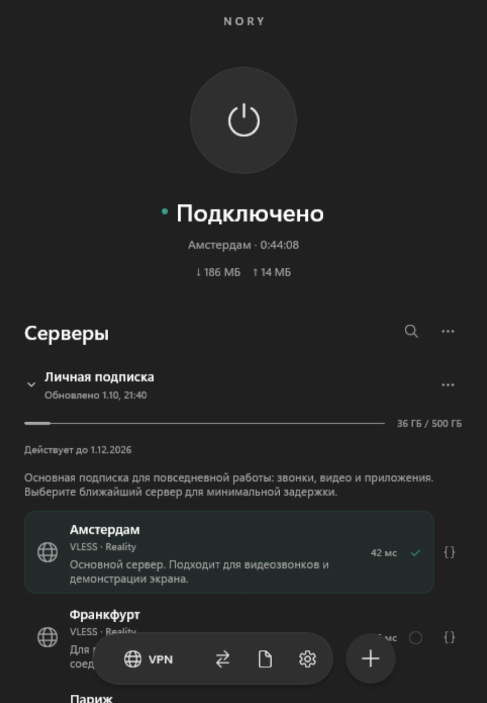
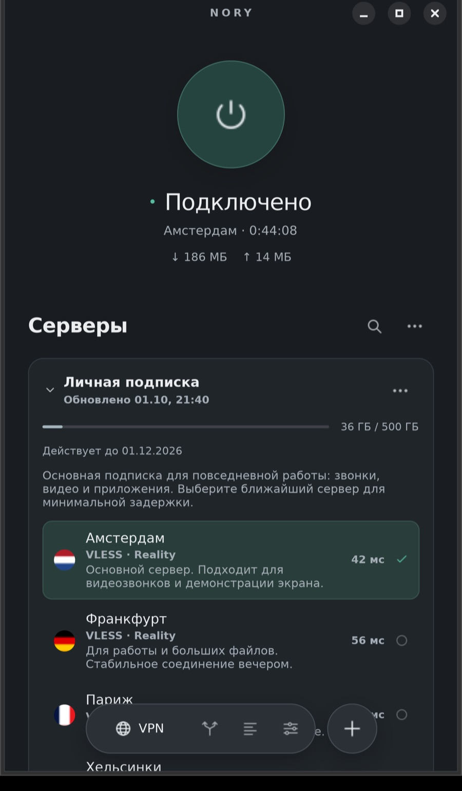
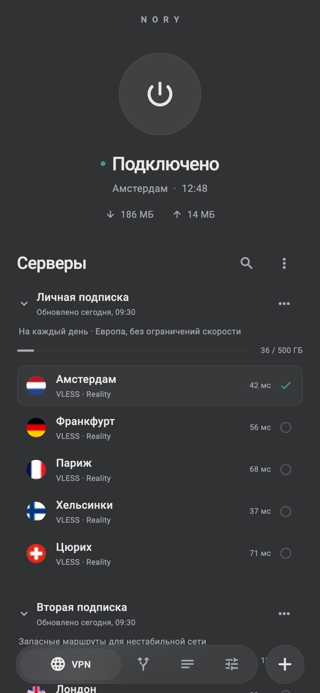

# NORY

**VPN-клиент на Xray и sing-box для всех ваших устройств**

Подписки, маршрутизация из JSON сервера и обход VPN для сайтов и приложений — 
в нативном интерфейсе для macOS, Windows, Linux и Android.

 

**[Скачать](#скачать)** · [Установка](INSTALL.md) · [Что нового](CHANGELOG.md) · [Сообщить об ошибке](https://github.com/wasteprince/nory/issues)

 

<table>
  <tr>
    <td align="center" width="25%"></td>
    <td align="center" width="25%"></td>
    <td align="center" width="25%"></td>
    <td align="center" width="25%"></td>
  </tr>
  <tr>
    <td align="center"><b>macOS</b> SwiftUI · Liquid Glass</td>
    <td align="center"><b>Windows</b> WinUI 3 · Acrylic</td>
    <td align="center"><b>Linux</b> GTK4 · libadwaita</td>
    <td align="center"><b>Android</b> Flutter · VpnService</td>
  </tr>
</table>

Настоящие снимки приложений с демонстрационными данными

 

## Скачать

**Android — [NORY 0.4.15](https://github.com/wasteprince/nory/releases/tag/v0.4.15)** · Windows — [0.4.14](https://github.com/wasteprince/nory/releases/tag/v0.4.14) · macOS и Linux — [0.4.13](https://github.com/wasteprince/nory/releases/tag/v0.4.13)

 

 

| Система | Требования | Файл |
| :--- | :--- | :--- |
| **Windows 11** | x64 (Intel, AMD) · сборка 22000+ | [Установщик EXE](https://github.com/wasteprince/nory/releases/download/v0.4.14/NORY-0.4.14-windows-x64-setup.exe) |
| **Windows 11 ARM** | ARM64, включая Snapdragon | [Установщик EXE](https://github.com/wasteprince/nory/releases/download/v0.4.14/NORY-0.4.14-windows-arm64-setup.exe) |
| **Windows 10** | x64 · 21H2, 22H2, LTSC 2021 (сборка 19044+) | [Установщик EXE](https://github.com/wasteprince/nory/releases/download/v0.4.14/NORY-0.4.14-windows10-x64-setup.exe) |
| **macOS** | macOS 26+ · Apple Silicon, включая MacBook Neo | [Установщик PKG](https://github.com/wasteprince/nory/releases/download/v0.4.13/NORY-0.4.13-macos-arm64.pkg) |
| **macOS Intel** | macOS 26+ · x86_64 | [Установщик PKG](https://github.com/wasteprince/nory/releases/download/v0.4.13/NORY-0.4.13-macos-x86_64.pkg) |
| **Android** | Android 8.0+ · ARM64, ARMv7, x86‑64 | [APK](https://github.com/wasteprince/nory/releases/download/v0.4.15/NORY-0.4.15-android.apk) |
| **Ubuntu / Debian** бета | Ubuntu 24.04+, Debian 13+ · amd64 | [Пакет DEB](https://github.com/wasteprince/nory/releases/download/v0.4.13/nory_0.4.13_amd64.deb) |
| **Arch Linux** бета | x86_64 | [Пакет pkg.tar.zst](https://github.com/wasteprince/nory/releases/download/v0.4.13/nory-0.4.13-1-x86_64.pkg.tar.zst) |

<b>Архивы, образы дисков и контрольные суммы</b>

 

| Платформа | Другие форматы |
| :--- | :--- |
| macOS Apple Silicon | [DMG](https://github.com/wasteprince/nory/releases/download/v0.4.13/NORY-0.4.13-macos-arm64.dmg) · [ZIP](https://github.com/wasteprince/nory/releases/download/v0.4.13/NORY-0.4.13-macos-arm64.zip) |
| macOS Intel | [DMG](https://github.com/wasteprince/nory/releases/download/v0.4.13/NORY-0.4.13-macos-x86_64.dmg) · [ZIP](https://github.com/wasteprince/nory/releases/download/v0.4.13/NORY-0.4.13-macos-x86_64.zip) |
| Windows 11 x64 | [ZIP](https://github.com/wasteprince/nory/releases/download/v0.4.14/NORY-0.4.14-windows-x64.zip) |
| Windows 11 ARM64 | [ZIP](https://github.com/wasteprince/nory/releases/download/v0.4.14/NORY-0.4.14-windows-arm64.zip) |
| Windows 10 x64 | [ZIP](https://github.com/wasteprince/nory/releases/download/v0.4.14/NORY-0.4.14-windows10-x64.zip) |

ZIP для Windows предназначен для ручного развёртывания и не устанавливает службу TUN — для обычной установки используйте EXE.
Контрольные суммы: [Windows · 0.4.14](https://github.com/wasteprince/nory/releases/download/v0.4.14/SHA256SUMS.txt) · [остальные платформы · 0.4.13](https://github.com/wasteprince/nory/releases/download/v0.4.13/SHA256SUMS.txt).

> [!TIP]
> Windows и Linux обновляются сами: NORY проверяет подписанный манифест при запуске. Android с версии 0.4.15 обновляется кнопкой в «Настройках». На macOS установите новую версию поверх старой — подписки и настройки сохранятся.

## Что нового

**0.4.15 · Android.** VPN больше не включается сам после отключения и не зависает на «Отключение…»; обновление прямо из приложения.

**0.4.14 · Windows.** Исправлена ошибка «Не удалось выбрать свободное имя TUN»: NORY сам удаляет оставшиеся адаптеры при запуске Windows, открытии приложения и после каждого отключения.

**0.4.13 · все платформы:**

- **Интернет не пропадает после сбоя.** Если окно NORY аварийно закрылось, системная служба сама снимает туннель и маршруты на Windows и Linux.
- **Windows 10 выглядит как Windows 11:** прозрачность Acrylic, собственная полоса заголовка и значки Fluent, где система их поддерживает.
- **Выход больше не зависает.** Если VPN не удалось отключить, приложение остаётся рабочим и предлагает закрыться всё равно.
- **Служба Windows перезапускается после сбоя**, а проверка недоступных серверов идёт в несколько раз быстрее.
- **Android:** надёжнее автоподключение при запуске, журнал не теряет события, плавная прокрутка длинных списков, подтверждение удаления подписки.

[Полная история изменений →](CHANGELOG.md)

## Возможности

<table>
  <tr>
    <td width="50%" valign="top">
      <h3>Подписки</h3>
      Несколько источников, описания серверов, остаток трафика и срок действия. Автообновление, HWID устройства и загрузка JSON-варианта подписки с правилами провайдера.
    </td>
    <td width="50%" valign="top">
      <h3>Серверы</h3>
      Поиск, флаги стран, протокол и транспорт, просмотр JSON. Проверка задержки по ICMP, TCP или через прокси и выбор самого быстрого сервера.
    </td>
  </tr>
  <tr>
    <td valign="top">
      <h3>Маршрутизация</h3>
      Routing, DNS и балансировщики из JSON сервера сохраняются. Обход VPN для российских сайтов, своих доменов с поддоменами и выбранных приложений.
    </td>
    <td valign="top">
      <h3>Системный VPN</h3>
      Xray и sing-box TUN на компьютерах, Android VpnService без root. Привилегированная часть работает отдельной службой с минимальными правами.
    </td>
  </tr>
  <tr>
    <td valign="top">
      <h3>Нативный интерфейс</h3>
      SwiftUI на macOS, WinUI 3 на Windows, GTK4 на Linux и Flutter на Android. Тёмное оформление, стеклянные панели и плавающая навигация.
    </td>
    <td valign="top">
      <h3>Подписанные обновления</h3>
      Манифесты обновлений подписаны Ed25519 и проверяются перед установкой. Каналы разделены по системе и архитектуре процессора.
    </td>
  </tr>
</table>

## Установка

1. Скачайте файл для своей системы из таблицы выше.
2. Запустите установщик. На Windows он подготовит службу TUN, на macOS — системный компонент VPN.
3. Нажмите **+**, вставьте ссылку на подписку, ключ сервера или JSON Xray — и подключайтесь.

Подробности для каждой платформы, первый запуск на macOS и переход со старых версий — в **[инструкции по установке](INSTALL.md)**.

 

[Релизы](https://github.com/wasteprince/nory/releases) · [Установка](INSTALL.md) · [История изменений](CHANGELOG.md) · [Обратная связь](https://github.com/wasteprince/nory/issues) · [Telegram](https://t.me/linuxset)

Публичный репозиторий содержит установщики, документацию и превью. Исходный код не публикуется. Лицензии компонентов входят в пакеты.

